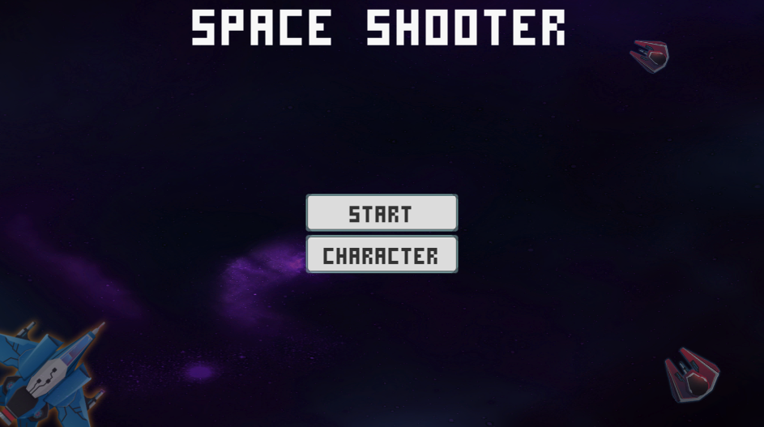
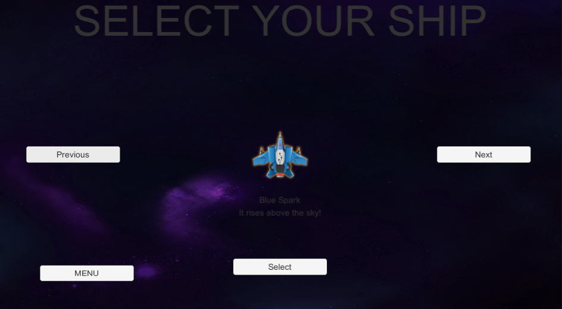
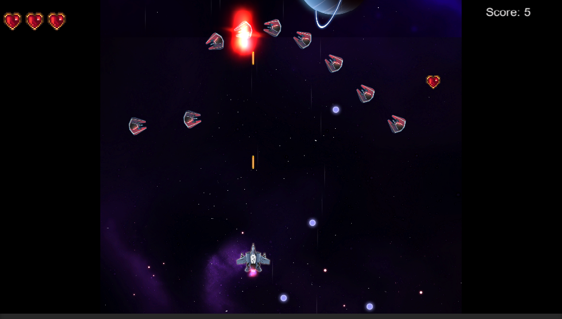
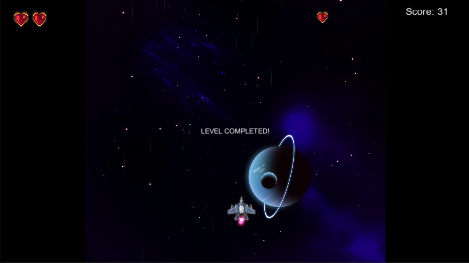
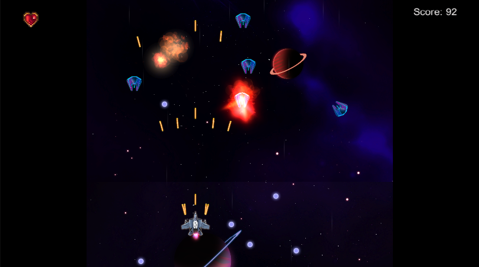
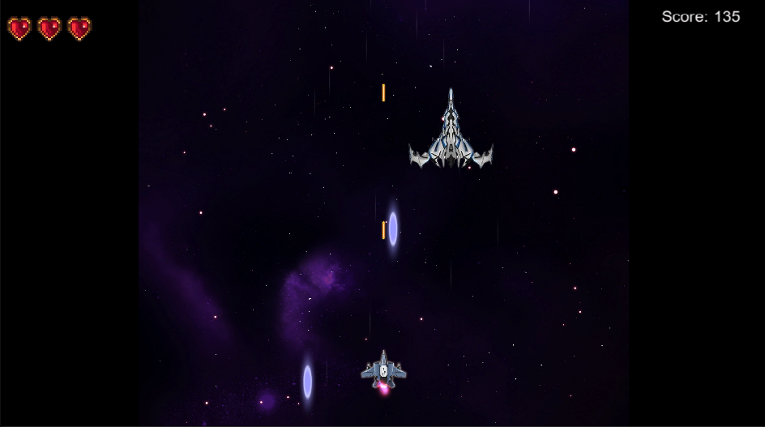

# 2D Space Shooter

A classic arcade-style 2D space shooter game built with Unity.

## Features
- Player spaceship with shooting and movement
- Multiple enemy types and waves
- Boss level with unique boss behavior
- Power-ups and bonuses
- Level progression and scoring
- Character selection and menu system
- Modern UI and sound effects

## Getting Started

### Prerequisites
- Unity 2021.3 LTS or newer (recommended)
- Windows or MacOS

### How to Play
1. Open the project in Unity.
2. Open the folder `Assets/` then `Space Shooter/` and finally `Scenes/` folder and load the main scene (e.g., `MainMenu`).
3. Press Play to start the game.
4. Left click, hold and drag to move the ship.
5. Defeat enemies, collect bonuses, and face the boss!

## Project Structure
- `Assets/Space Shooter/Scripts/` — All gameplay scripts
- `Assets/Space Shooter/Scenes/` — Game scenes
- `Assets/Space Shooter/Prefabs/` — Player, enemy, and boss prefabs
- `Assets/Space Shooter/Sprites/` — Art assets
- `Assets/Space Shooter/Audio/` — Sound effects and music

## Screenshots

### Main Menu

### Gameplay

### Boss Fight

## Customization
- Adjust enemy waves and boss behavior in the Inspector
- Add new power-ups or enemy types by extending scripts
- Change player sprites in the Character Selector

## Credits
- [Space Shooter FREE](https://assetstore.unity.com/packages/templates/packs/space-shooter-free-107260) in the Unity Asset Store

